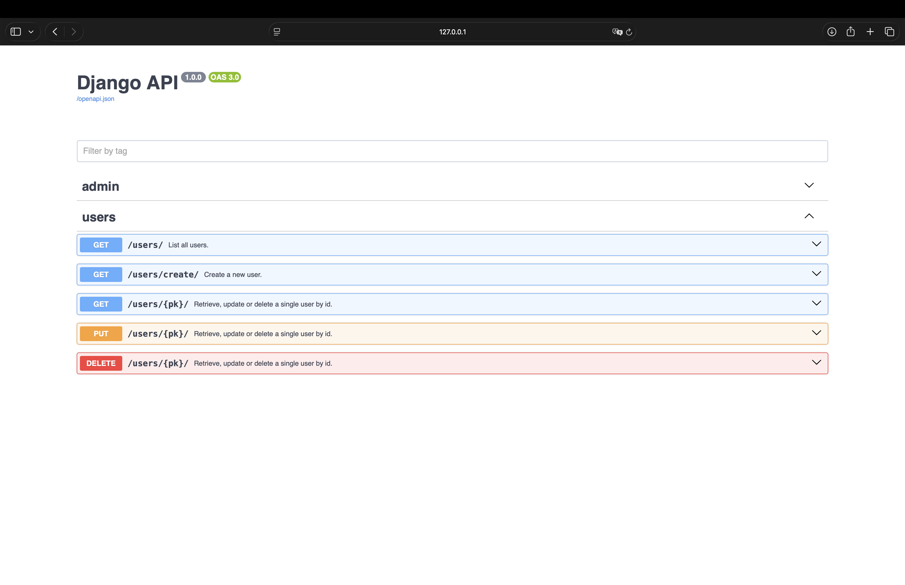

<p align="center">
  
</p>
<p align="center">
    <em>Drop-in interactive API docs for Django — Swagger UI, FastAPI-style, with zero decorators and zero extra dependencies.</em>
</p>
<p align="center">
<a href="https://github.com/NEFORCEO/djangoapi" target="_blank">
    
</a>
<a href="https://www.python.org/" target="_blank">
    
</a>
<a href="https://www.djangoproject.com/" target="_blank">
    
</a>
</p>

---

**Source Code**: <a href="https://github.com/NEFORCEO/djangoapi" target="_blank">https://github.com/NEFORCEO/djangoapi</a>

---

djangoapi turns any Django project into a self-documenting API. Add one line to `INSTALLED_APPS` and a full Swagger UI shows up at `/docs` — no urls.py edits, no serializers, no decorators on your views. It walks your project's own `urlpatterns` and builds the OpenAPI schema from what it finds.

Key features:

- **Zero config** — the only thing you touch is `INSTALLED_APPS`. No `urls.py` changes, no middleware to wire up by hand.
- **Automatic** — paths, path parameters and HTTP methods are all inferred by walking the URLconf and the views it points to. Nothing to decorate, nothing to register.
- **Typed path params** — `<int:pk>`, `<uuid:token>`, `<slug:handle>` are mapped to real OpenAPI types straight from Django's own path converters.
- **Smart request bodies** — instead of a blank `{}`, djangoapi reads a handler's source for `request.POST.get(...)` / `request.data[...]` style access and pre-fills the example with the fields it actually uses.
- **Interactive** — "Try it out" works against your real endpoints out of the box; the CSRF cookie is forwarded automatically for unsafe methods.
- **No extra dependencies** — pure Django. No Pydantic, no DRF required (though it plays nicely with DRF views if you have them).

## Requirements

Python 3.10+, Django 5.2+.

## Installation

```console
$ pip install django-api
```

## Example

Add `"djangoapi"` to `INSTALLED_APPS`:

```python
INSTALLED_APPS = [
    ...,
    "djangoapi",
]
```

That's it. Run your project as usual:

```console
$ python manage.py runserver
```

### Check it

Go to <a href="http://127.0.0.1:8000/docs" target="_blank">http://127.0.0.1:8000/docs</a>.

You will see the automatic interactive API documentation, generated straight from your `urlpatterns`:



Expand any route to inspect path parameters and, where djangoapi can infer them, request body fields. Click **Try it out** to execute the request for real and see the actual response — session auth and CSRF are handled for you.

## Configuration

Everything is optional — djangoapi works with sane defaults out of the box. Override title, version, description, or the docs paths themselves via a `DJANGOAPI` dict in `settings.py`:

```python
DJANGOAPI = {
    "TITLE": "My API",
    "VERSION": "1.0.0",
    "DESCRIPTION": "Internal API for the mobile app.",
    "DOCS_URL": "/docs",
    "OPENAPI_URL": "/openapi.json",
}
```

## How it works

- `DjangoAPIConfig.ready()` prepends `djangoapi.middleware.DjangoAPIMiddleware` to `settings.MIDDLEWARE` the moment the app is loaded — before Django builds its middleware chain — which is what lets a single `INSTALLED_APPS` entry serve `/docs` and `/openapi.json` with no `urls.py` changes.
- The middleware intercepts those two paths ahead of normal URL resolution; every other request passes straight through untouched.
- `djangoapi/generator.py` walks `get_resolver().url_patterns` recursively, resolving `path()` converters into OpenAPI parameter types and reading each view's docstring for a summary.
- HTTP methods are inferred from class-based views (Django's `View` or DRF's `APIView`/`api_view`) by checking which handlers they actually implement; plain function-based views default to `GET`.
- Request bodies are inferred by a light, best-effort read of the handler's own source — no execution, no imports of your models, just pattern matching for body access.

## Try the demo project

The repo ships a throwaway Django project under [`test/`](test) wired up with a couple of sample endpoints, just to poke at the Swagger UI:

```console
$ cd test
$ python manage.py runserver
```

Then open `http://127.0.0.1:8000/docs`.

