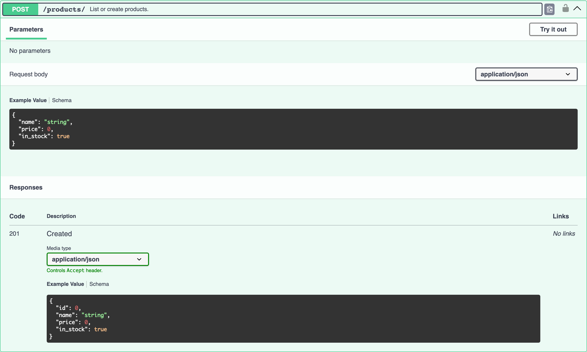

# DRF Serializers

djo is dependency-free — it doesn't require Django REST Framework — but if it's installed and a view declares a `serializer_class`, djo uses it to build accurate request and response schemas straight from the serializer's declared fields, instead of guessing from source.

```python
from rest_framework import serializers
from rest_framework.generics import ListCreateAPIView
from rest_framework.permissions import IsAuthenticated


class ProductSerializer(serializers.Serializer):
    id = serializers.IntegerField(read_only=True)
    name = serializers.CharField()
    price = serializers.DecimalField(max_digits=10, decimal_places=2)
    in_stock = serializers.BooleanField(default=True)


class ProductListCreateView(ListCreateAPIView):
    """List or create products."""

    serializer_class = ProductSerializer
    permission_classes = [IsAuthenticated]
```

Expanded `POST /products/` in Swagger UI:



Note what happened automatically:

- `id` is `read_only=True` on the serializer, so it's **excluded from the request body** but still present in the response schema.
- `name` and `price` have no default and no `required=False`, so they're marked `"required": ["name", "price"]`.
- Types come straight from the field classes — `IntegerField` → `integer`, `DecimalField` → `number`, `BooleanField` → `boolean` — not guessed from source.
- `permission_classes = [IsAuthenticated]` triggered a lock icon and an `Authorize` requirement — see [Security Schemes](security.md).
- `ListCreateAPIView` (DRF's `CreateModelMixin`) made djo document the `POST` response as `201 Created` instead of the generic `200`, and the `GET` response as an `array` of the serializer schema (DRF's `ListModelMixin`).

## Field type mapping

| DRF field | OpenAPI schema |
|---|---|
| `BooleanField`, `NullBooleanField` | `{"type": "boolean"}` |
| `IntegerField` | `{"type": "integer"}` |
| `FloatField`, `DecimalField` | `{"type": "number"}` |
| `CharField`, `SlugField` | `{"type": "string"}` |
| `EmailField` | `{"type": "string", "format": "email"}` |
| `URLField` | `{"type": "string", "format": "uri"}` |
| `UUIDField` | `{"type": "string", "format": "uuid"}` |
| `DateField` | `{"type": "string", "format": "date"}` |
| `DateTimeField` | `{"type": "string", "format": "date-time"}` |
| `ChoiceField` | `{"type": "string", "enum": [...]}` — populated from `field.choices` |
| `ListField` | `{"type": "array", "items": {"type": "string"}}` |
| `PrimaryKeyRelatedField` | `{"type": "integer"}` |
| anything else | `{"type": "string"}` (fallback) |

A field's `help_text`, if set, is carried straight into the schema's `"description"`:

```python
email = serializers.EmailField(help_text="Used for login and notifications.")
```

produces `{"type": "string", "format": "email", "description": "Used for login and notifications."}`.

## Request vs. response fields

djo builds two different schemas from the same serializer:

| Direction | Excludes | Marks `required` |
|---|---|---|
| Request (`requestBody`) | `read_only` fields | yes, from `field.required` |
| Response (`200`/`201` body) | `write_only` fields | no — a representation isn't validated |

## What's never called

Only the **static** `serializer_class` attribute is read. djo never calls `get_serializer_class()` — projects commonly override it with logic that branches on `self.request` or `self.action`, which isn't safe to call outside of an actual request/response cycle. If your view only defines `get_serializer_class()`, djo falls back to the source-based inference described in [Request Bodies](request-bodies.md).
