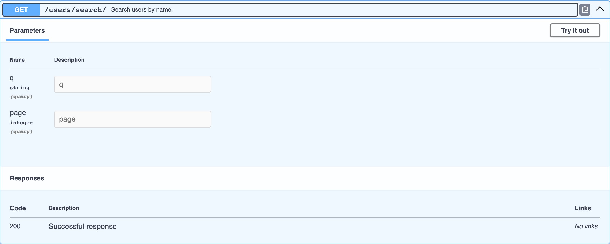

# Query Parameters

djo reads the handler's own source for `request.GET` access and turns it into OpenAPI query parameters — including type and required-ness.

```python
def search_users(request):
    """Search users by name."""
    query = request.GET.get("q", "")
    page = request.GET.get("page", 1)
    return JsonResponse({"query": query, "page": page, "results": []})
```

Expanded in Swagger UI:



## How type and required-ness are inferred

| Source pattern | `required` | `schema` |
|---|---|---|
| `request.GET["tag"]` | `true` | `{"type": "string"}` (bracket access has no default to type-check) |
| `request.GET.get("page", 1)` | `false` | `{"type": "integer"}` — inferred from the default literal |
| `request.GET.get("active", True)` | `false` | `{"type": "boolean"}` |
| `request.GET.get("q", "")` | `false` | `{"type": "string"}` |
| `request.GET.get("tag")` | `false` | `{"type": "string"}` (no default to infer from) |

The rule is simple: **`[...]` access means the code will raise `KeyError` if the parameter is missing, so it's required. `.get(...)` always has a fallback, so it's optional** — and if that fallback is a literal, its Python type becomes the parameter's OpenAPI type.

!!! note "Only literal defaults are typed"
    `request.GET.get("page", DEFAULT_PAGE)` — where the default is a variable, not a literal — still produces a valid (optional, string-typed) parameter; djo just can't infer a more specific type from a name it can't resolve statically.
