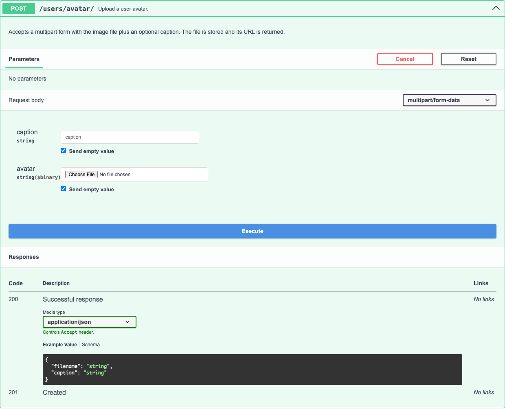

# Request Bodies

For `POST`/`PUT`/`PATCH` operations, djo builds a `requestBody` schema in three steps, each preferred over the next: a declared DRF serializer ([see DRF Serializers](drf-serializers.md)), a typed handler signature, and finally a fallback read of the handler's own source.

## Typed handler signatures

Extra handler parameters carrying a plain type annotation ([see Query Parameters](query-parameters.md#typed-handler-signatures) for the full list of supported types) become request body fields for `POST`/`PUT`/`PATCH`, instead of query parameters:

```python
def create_user(request, name: str, age: int, active: bool = True):
    ...
```

produces:

```json
{
  "type": "object",
  "properties": {
    "name": { "type": "string" },
    "age": { "type": "integer" },
    "active": { "type": "boolean" }
  },
  "required": ["name", "age"]
}
```

A parameter is `required` when it has no default value — exactly like a regular Python function call.

!!! warning "Django doesn't bind these values for you"
    Django's dispatcher only ever calls a view with `request` plus whatever a `path()` converter captured — it never fills in extra parameters from the request body. A required parameter with no default will raise `TypeError: missing N required positional arguments` the moment the view is hit, so a real handler needs *every* extra parameter to have a default (matching its annotated type) and to read the actual value itself, typically off `request.data`/`request.POST`:
    ```python
    def create_user(request, name: str = "", age: int = 0, active: bool = True):
        name = request.data.get("name", name)
        age = int(request.data.get("age", age))
        ...
    ```
    The annotation only feeds the OpenAPI schema — it doesn't wire up the binding.

## Without a serializer or typed signature

djo scans the concrete handler for body-access markers — `request.body`, `request.POST`, `request.FILES`, `request.data`, `json.loads` — and, if any are found, extracts field names from patterns like `request.POST.get("name")` or `request.data["age"]`:

```python
def create_user(request):
    name = request.POST.get("name")
    age = request.data["age"]
    ...
```

produces:

```json
{
  "type": "object",
  "properties": {
    "name": { "type": "string" },
    "age": { "type": "string" }
  },
  "example": { "name": "", "age": "" }
}
```

Field types are always `string` in this fallback path — without a serializer or a typed signature, djo has no reliable way to know a field is actually numeric or boolean. If you need accurate types, declare a DRF `serializer_class` or add type annotations to the handler's parameters instead.

## File uploads

If the handler reads `request.FILES`, djo documents the field as a binary upload and switches the whole `requestBody` to `multipart/form-data` — file fields and any regular fields read from `request.POST` are merged into the same form schema:

```python
class AvatarUpload(View):
    """
    Upload a user avatar.

    Accepts a multipart form with the image file plus an optional caption.
    The file is stored and its URL is returned.
    """

    def post(self, request):
        avatar = request.FILES.get("avatar")
        caption = request.POST.get("caption", "")
        return JsonResponse({"filename": avatar.name if avatar else "", "caption": caption}, status=201)
```

Expanded in Swagger UI — note the file picker for `avatar` and the multiline docstring rendered as the operation's markdown description:



`request.FILES["avatar"]` (bracket access) works the same way as `.get(...)` here — either is enough to mark the field as `{"type": "string", "format": "binary"}`.

## No body access, no `requestBody`

If a handler never touches the request body, djo **omits `requestBody` entirely** rather than emitting a misleading empty `{}` schema — this was the whole point of moving past a naive "every POST has a body" assumption:

```python
def create_user(request):
    """Create a new user."""
    return JsonResponse({"id": 3, "name": "New user"}, status=201)
```

This handler never reads `request.POST`/`request.data`, so no `requestBody` shows up in Swagger UI for it — nothing to fill in, nothing misleading to guess at.

## Detected body markers

| Marker | Typical usage |
|---|---|
| `request.POST` | Classic form-encoded Django views |
| `request.data` | Django REST Framework views |
| `request.body` | Manual JSON parsing (`json.loads(request.body)`) |
| `request.FILES` | File uploads |
| `json.loads` | Manual JSON parsing, any source |
