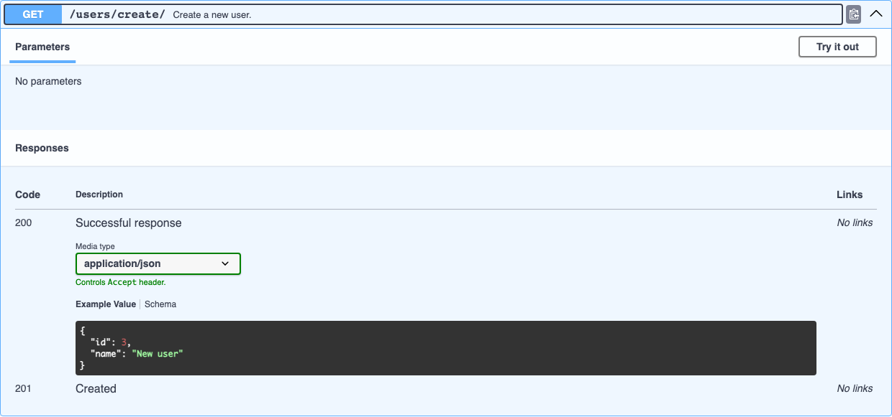

# Response Schema

For the success response, djo builds a body schema in three steps, each one preferred over the next:

1. A declared DRF `serializer_class` ([see DRF Serializers](drf-serializers.md)).
2. A literal `return JsonResponse({...})` / `return Response({...})` in the handler's own source.
3. Nothing — the response is documented with just a status code and no body.

## Reading a literal response

djo parses the handler's source with Python's `ast` module (nothing is executed) and looks for a `return` statement whose value is a `JsonResponse(...)`/`Response(...)` call with a dict (or a list of dicts) as its first argument:

```python
def get_user_or_404(request, pk):
    """Look up a single user, or 404 if it doesn't exist."""
    if pk != 1:
        raise Http404("User not found")
    return JsonResponse({"id": pk, "name": "Ada"})
```

produces:

```json
{
  "type": "object",
  "properties": {
    "id": { "type": "integer" },
    "name": { "type": "string" }
  }
}
```

A list literal (`return JsonResponse([{...}, ...])`) becomes an `array` of that same object schema.

## Real example values, not just types

When a value in the literal is itself a literal (`"Ada"`, `3`, `True`, ...), djo keeps the actual value as the schema's `"example"` — not just its type. Swagger UI's **Example Value** tab then shows real, representative data instead of a generic `"string"`/`0` placeholder:

```python
def create_user(request):
    """Create a new user."""
    return JsonResponse({"id": 3, "name": "New user"}, status=201)
```



Values that aren't literals — a variable, an attribute, a function call like `uuid4()` — have no real value to read at analysis time, so only their inferred type is used.

## How field types are guessed

| Value expression | Inferred type | Example |
|---|---|---|
| A literal (`"Ada"`, `1`, `1.5`, `True`) | Its Python type, directly | `"name": "Ada"` → `string` |
| A list literal | `array`, typed from its first element | `"results": []` → `array` of `string` |
| A nested dict literal | A nested `object` schema, recursively | `"users": [{"id": 1, ...}]` → array of objects |
| A bare name/attribute matching a typed handler parameter | That parameter's declared type ([see Typed Parameters](query-parameters.md#typed-handler-signatures)) | `"age": age` with `age: int` → `integer` |
| A bare name/attribute called `id`, `pk`, or ending in `_id` | `integer` | `"id": pk` → `integer` |
| A bare name/attribute starting with `is_`/`has_` | `boolean` | `"is_active": user.is_active` → `boolean` |
| Anything else (a variable djo can't type any other way) | `string` | — |

The parameter cross-reference is what makes typed handlers so accurate end to end — a handler that both accepts and echoes typed fields gets a fully-typed request *and* response with no guessing at all:

```python
def create_user_typed(request, name: str = "", age: int = 0, active: bool = True):
    name = request.GET.get("name", name)
    age = int(request.GET.get("age", age))
    active = request.GET.get("active", str(active)).lower() == "true"
    return JsonResponse({"id": uuid4(), "name": name, "age": age, "active": active}, status=201)
```

`age` and `active` in the response are typed `integer`/`boolean` — not because of any name heuristic, but because they're the exact same identifiers as the `age: int`/`active: bool` parameters above:


!!! note "Only the first matching `return` counts"
    If a handler has several `return JsonResponse(...)` statements (e.g. one per branch), djo uses whichever one it encounters first when walking the source top to bottom — it doesn't try to merge or reconcile schemas across branches.
