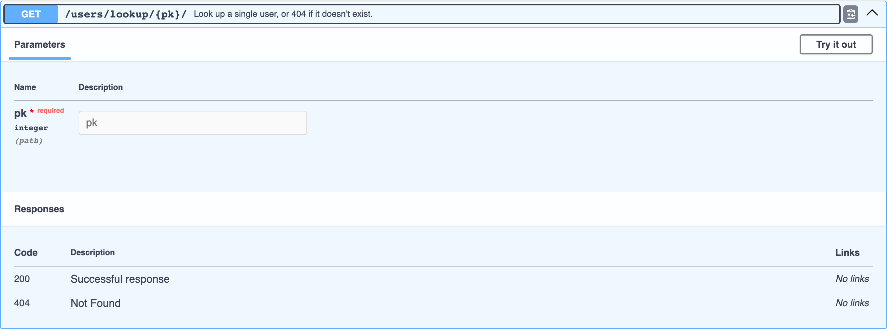

# Коды ошибок

Помимо успешного ответа, djo сканирует исходник хендлера на коды статусов и поднятые исключения, добавляя соответствующую запись под каждый найденный код.

```python
from django.http import Http404, JsonResponse


def get_user_or_404(request, pk):
    """Look up a single user, or 404 if it doesn't exist."""
    if pk != 1:
        raise Http404("User not found")
    return JsonResponse({"id": pk, "name": "Ada"})
```



## Что определяется

| Паттерн | Пример | Код(ы) статуса |
|---|---|---|
| Литерал `status=` / `status_code=` | `JsonResponse(..., status=404)` | само значение литерала |
| Константы DRF `status.HTTP_xxx_*` | `Response(..., status=status.HTTP_400_BAD_REQUEST)` | разобрано из имени константы |
| Поднятые исключения | `raise Http404`, `raise NotFound`, `raise ValidationError`, `raise PermissionDenied`, `raise NotAuthenticated`, `raise AuthenticationFailed`, `raise MethodNotAllowed`, `raise Throttled`, `raise ParseError` | сопоставлено со стандартным HTTP-кодом |

Описания берутся напрямую из `http.HTTPStatus` стандартной библиотеки Python — `404` становится `"Not Found"`, `403` — `"Forbidden"` и так далее, без единой захардкоженной строки, которую нужно поддерживать вручную.

## Успешные коды не теряются

Успешный ответ вычисляется первым — `200` по умолчанию, либо `201 Created` для `POST` на DRF-view с `CreateModelMixin` — и любой код ошибки, совпавший с ним (например, явный литерал `status=200`), отбрасывается, а не перезаписывает более богатую запись успешного ответа (которая может содержать схему тела — см. [DRF-сериализаторы](drf-serializers.md)).

## Здесь только чтение исходника, ничего не исполняется

Как и в случае с [телом запроса](request-bodies.md) и [query-параметрами](query-parameters.md), это сканирование исходника через регулярные выражения — ни одна ветка кода хендлера реально не выполняется, так что `raise Http404` глубоко внутри условия, которое вы никогда не заходите на практике, всё равно попадёт в документацию. Воспринимайте это как «коды, которые хендлер способен вернуть», а не «коды, которые он точно вернёт».
