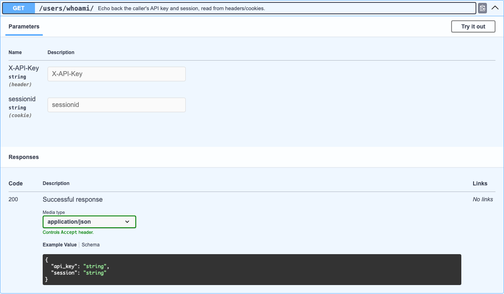

# Заголовки и куки

djo читает исходник хендлера на предмет обращений к `request.headers` и `request.COOKIES` — так же, как читает `request.GET` для [query-параметров](query-parameters.md) — и превращает каждое такое обращение в OpenAPI-параметр с `"in": "header"` / `"in": "cookie"`.

```python
def whoami(request):
    """Echo back the caller's API key and session, read from headers/cookies."""
    api_key = request.headers.get("X-API-Key")
    session = request.COOKIES.get("sessionid")
    return JsonResponse({"api_key": api_key, "session": session})
```

Развёрнуто в Swagger UI:



## Как определяются тип и обязательность

Точно то же правило, что и для query-параметров: обращение через `[...]` не имеет запасного значения — значит, параметр обязателен; у `.get(...)` запасное значение всегда есть — значит, параметр опционален, а литеральное значение по умолчанию используется, чтобы определить тип точнее, чем просто `string`.

| Паттерн в исходнике | `in` | `required` | `schema` |
|---|---|---|---|
| `request.headers["X-API-Key"]` | `header` | `true` | `{"type": "string"}` |
| `request.headers.get("X-API-Key")` | `header` | `false` | `{"type": "string"}` |
| `request.COOKIES["sessionid"]` | `cookie` | `true` | `{"type": "string"}` |
| `request.COOKIES.get("sessionid", "")` | `cookie` | `false` | `{"type": "string"}` |

## Это не замена авторизации

Это обычное, эвристическое чтение произвольных обращений к заголовкам/кукам в исходнике хендлера — оно никак не связано с [определением схем безопасности](security.md) в djo, которое основано на `permission_classes`/`authentication_classes`/`LoginRequiredMixin` и включает кнопку **Authorize** в Swagger. Хендлер, который читает кастомный заголовок `X-API-Key` для своей самописной проверки, всё равно должен реализовать эту логику вручную — djo лишь документирует, что такой заголовок существует.
