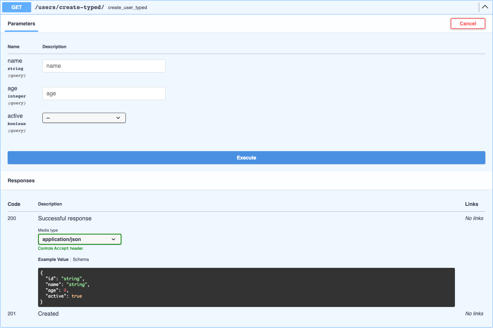

# Схема ответа

Для успешного ответа djo строит схему тела в три шага, каждый в приоритете над следующим:

1. Объявленный DRF `serializer_class` (см. [DRF-сериализаторы](drf-serializers.md)).
2. Литерал `return JsonResponse({...})` / `return Response({...})` в исходнике хендлера.
3. Ничего — ответ документируется только кодом статуса, без тела.

## Чтение литерала ответа

djo разбирает исходник хендлера модулем `ast` (ничего не исполняется) и ищет `return`-инструкцию, значение которой — вызов `JsonResponse(...)`/`Response(...)` со словарём (или списком словарей) первым аргументом:

```python
def get_user_or_404(request, pk):
    """Look up a single user, or 404 if it doesn't exist."""
    if pk != 1:
        raise Http404("User not found")
    return JsonResponse({"id": pk, "name": "Ada"})
```

даёт:

```json
{
  "type": "object",
  "properties": {
    "id": { "type": "integer" },
    "name": { "type": "string" }
  }
}
```

Литерал-список (`return JsonResponse([{...}, ...])`) превращается в `array` из той же object-схемы.

## Как угадывается тип поля

| Выражение-значение | Определённый тип | Пример |
|---|---|---|
| Литерал (`"Ada"`, `1`, `1.5`, `True`) | Его Python-тип напрямую | `"name": "Ada"` → `string` |
| Литерал-список | `array`, типизированный по первому элементу | `"results": []` → `array` из `string` |
| Вложенный литерал-словарь | Вложенная `object`-схема, рекурсивно | `"users": [{"id": 1, ...}]` → массив объектов |
| Голое имя/атрибут, совпадающее с типизированным параметром хендлера | Объявленный тип этого параметра (см. [Типизированная сигнатура хендлера](query-parameters.md)) | `"age": age` при `age: int` → `integer` |
| Голое имя/атрибут `id`, `pk`, либо оканчивающееся на `_id` | `integer` | `"id": pk` → `integer` |
| Голое имя/атрибут, начинающееся с `is_`/`has_` | `boolean` | `"is_active": user.is_active` → `boolean` |
| Всё остальное (переменная, тип которой djo не может определить иначе) | `string` | — |

Сопоставление с параметрами хендлера — это то, что делает типизированные хендлеры настолько точными от начала и до конца: хендлер, который одновременно принимает и возвращает типизированные поля, получает полностью типизированные и запрос, и ответ без всякого угадывания:

```python
def create_user_typed(request, name: str = "", age: int = 0, active: bool = True):
    name = request.GET.get("name", name)
    age = int(request.GET.get("age", age))
    active = request.GET.get("active", str(active)).lower() == "true"
    return JsonResponse({"id": uuid4(), "name": name, "age": age, "active": active}, status=201)
```

`age` и `active` в ответе типизированы как `integer`/`boolean` — не по эвристике имени, а потому что это те же самые идентификаторы, что и параметры `age: int`/`active: bool` выше:



!!! note "Учитывается только первый подходящий `return`"
    Если у хендлера несколько `return JsonResponse(...)` (например, по одному на ветку), djo использует тот, что встретится первым при обходе исходника сверху вниз — схемы из разных веток не объединяются и не сверяются друг с другом.
