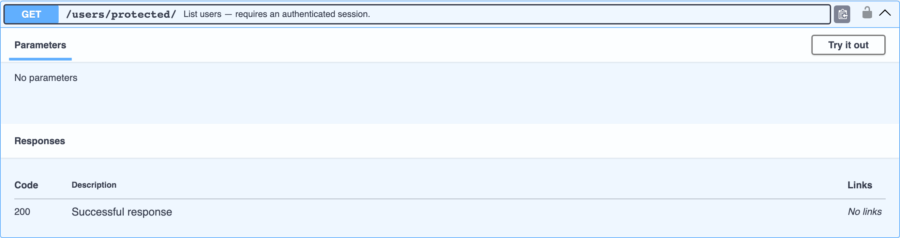

# Схемы авторизации

djo определяет требования авторизации прямо с классов view — ничего не создаётся, ничего не вызывается — и добавляет соответствующую запись в `components.securitySchemes`, замочек на операции и кнопку **Authorize** в Swagger UI.

```python
from django.contrib.auth.mixins import LoginRequiredMixin
from django.views import View


class ProtectedUserList(LoginRequiredMixin, View):
    """List users — requires an authenticated session."""

    def get(self, request):
        ...
```



Кнопка **Authorize** позволяет один раз вставить сессионную cookie или bearer-токен, и он будет применяться ко всем последующим вызовам **Try it out** — см. правый верхний угол на скриншоте в [Быстром старте](../quick-start.md).

## Что проверяется

| Сигнал | Источник | Схема |
|---|---|---|
| `LoginRequiredMixin` в MRO view | Обычный Django | `cookieAuth` |
| `permission_classes` содержит что-то, кроме `AllowAny` | DRF | `cookieAuth` (по умолчанию) |
| `authentication_classes` содержит класс с `Token`, `JWT` или `Bearer` в имени | DRF | `bearerAuth` |

View с `permission_classes = [AllowAny]` (или вовсе без `permission_classes` / `LoginRequiredMixin`) считается публичным — без требования `security`, без замочка.

## Добавляемые схемы

```json
{
  "cookieAuth": { "type": "apiKey", "in": "cookie", "name": "sessionid" },
  "bearerAuth": { "type": "http", "scheme": "bearer" }
}
```

В `components.securitySchemes` попадают только реально используемые хотя бы одной операцией схемы — у проекта без защищённых view кнопки `Authorize` не будет вовсе.

## Token/JWT-авторизация DRF

```python
class ProductListCreateView(ListCreateAPIView):
    serializer_class = ProductSerializer
    permission_classes = [IsAuthenticated]
    authentication_classes = [TokenAuthentication]  # или JWTAuthentication и т.д.
```

Поскольку `TokenAuthentication` совпадает с маркером `Token`, этот view документируется со схемой `bearerAuth` вместо стандартной `cookieAuth` — диалог Authorize в Swagger UI запросит bearer-токен.
